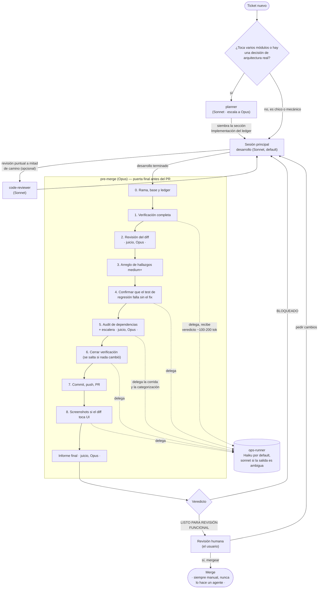
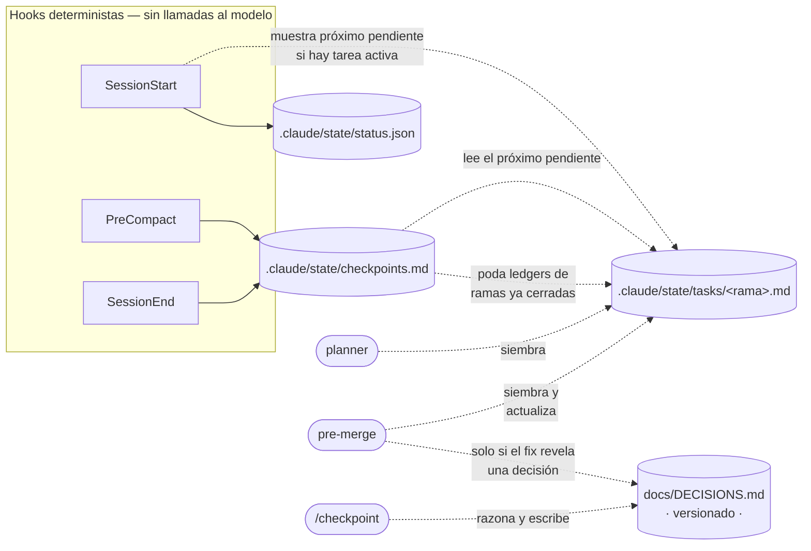

# Flujo de desarrollo con agentes

Cómo se mueve un ticket por la base: qué agente lo toca, en qué modelo
corre cada uno, y qué archivos usa para no perder el progreso si algo
interrumpe la sesión. El detalle normativo de cada paso vive en los
propios archivos (`agents/*.md`, `rules/resumable-tasks.md`); esto es el
mapa para orientarse antes de leerlos.

## El flujo completo

**Qué corre en qué modelo, y por qué** (`rules/agents-and-context.md`):

| Agente | Modelo | Rol |
| --- | --- | --- |
| `planner` | Sonnet (escala a Opus si la decisión de arquitectura lo justifica) | Diseña el plan, no escribe código. Solo para cambios que tocan varios módulos o tienen una decisión real. |
| Sesión principal | Sonnet | Desarrollo normal. Es el default de todo el sistema. |
| `code-reviewer` | Sonnet | Revisión puntual a mitad de camino, sobre un diff parcial. |
| `pre-merge` | **Opus** | Única excepción permanente al default. El juicio (clasificar hallazgos, decidir la escalera de dependencias, redactar el informe) es el producto — pagarlo en Sonnet arriesga dejar pasar exactamente lo que este agente existe para atrapar. |
| `ops-runner` | **Haiku** (`pre-merge` puede invocarlo con `model: sonnet` si la salida es ambigua) | Trabajo mecánico y desechable: correr comandos, leer su salida cruda, devolver un veredicto corto. Nunca opina. |

El punto que no es obvio a simple vista: `pre-merge` corre en Opus, pero **no lee la salida cruda de nada**. Los pasos 1, 4, 5, 6 y 8 son ejecución mecánica — los delega a `ops-runner` y solo recibe un veredicto de un par de líneas. Lo único que Opus procesa directamente es el diff (paso 2), la escalera de decisión de dependencias (paso 5) y la redacción del informe. Ver [`token-efficiency.md`](./token-efficiency.md) para cuánto pesa esa diferencia.

## Qué archivo guarda qué

Ningún agente confía en su propia memoria entre invocaciones — todo lo que necesita sobrevivir a una interrupción (quedarse sin tokens, una compactación, cerrar la sesión) queda escrito en disco. Cuatro archivos, cuatro responsabilidades distintas:

| Archivo | Quién escribe | Quién lee | ¿Se versiona? | Ciclo de vida |
| --- | --- | --- | --- | --- |
| `.claude/state/tasks/<rama>.md` | `planner` (siembra), `pre-merge` (siembra y actualiza), la sesión de desarrollo (marca ítems) | Cualquier agente resumible al arrancar; los hooks, para mostrar el próximo pendiente | No (`.claude/state/` está en `.gitignore`) | Uno por rama activa. Cada ítem con veredicto queda atado al commit en que era cierto (`@<sha>`) — ver `rules/resumable-tasks.md`, sección "Vigencia". Se poda solo cuando la rama deja de existir. |
| `.claude/state/checkpoints.md` | Hook `checkpoint.sh` (determinista, sin modelo) | La sesión, al arrancar, si quiere ver el historial | No | Marcador mecánico en `PreCompact`/`SessionEnd`: rama, último commit, `git status`, y un puntero al ledger activo. Nunca interpreta nada — eso lo hace `/checkpoint`. |
| `.claude/state/status.json` | La aplicación del proyecto (o sus scripts), no un agente de Claude Code | Hook `session-start.sh` (determinista) | No | Esquema libre. Existe para que el hook de arranque muestre un resumen del estado de la app sin releer código. |
| `docs/DECISIONS.md` | Comando `/checkpoint` (razona sobre la sesión) y `pre-merge` (solo si un fix revela una decisión de diseño) | Cualquiera, humano o agente, que necesite el porqué de una decisión pasada | **Sí** | Registro durable. A diferencia de los tres anteriores, esto es evidencia, no estado efímero — por eso vive fuera de `.claude/state/` y sí se commitea. |

La separación importa: mezclar "estado efímero de sesión" con "decisión durable" en el mismo archivo es lo que hace que un documento de decisiones se llene de entradas vacías que después hay que limpiar a mano — el problema concreto que describe el comentario en `hooks/checkpoint.sh`.
